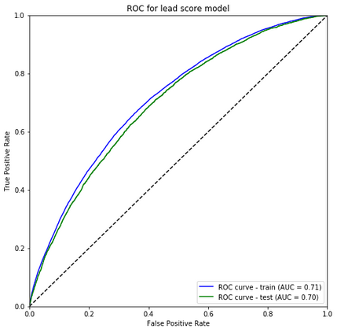

# LendingClub Investment Default Risk Analysis

###### |<a href='#1'> Introduction </a> | <a href='#2'> Data Source</a> | <a href='#3'> Data Preparation </a> |<a href='#4'> Algorithm </a>| <a href='#5'> Top Features </a> | <a href='#6'> Model Accuracy  </a> ||<a href='https://jesseqzhen.github.io/Fintech_Lending_Club/'> Python Code HTML Version </a>|

## Introduction

LendingClub is the world's largest peer-to-peer lending platform, which enables borrowers to obtain a loan, and investors to purchase notes backed by payments made on loans. The loan period is either 36 months or 60 months. Investors can search and browse the loan listings on Lending Club website or through its API service, and select loans that they want to invest in based on the information supplied about the borrower, the loan grade, and the loan amount. 

Investors make money from interest. At the same time, investors face default risk. LendingClub assigns a grade (A-E) to each note, reflective of the credit risk assessment of the corresponding loan. Notes with greater credit risk are assigned higher interest rates. Based on the year 2014 loan data Lending Club released, more than 13% of the 36-month loans were "charged-off" (when a loan is no later than 150 days past due). Thus, it's crucial for investors to build a portfolio of notes that matches their investment objectives and at the same time reduces their exposure to bad loans.

This project uses historical LendingClub loan data to build a machine leaning model to identify the most important factors related to credit risk and to predict the default risk for each current loan. The moment new loans are added to the LendingClub platform, the algorithm analyzes the variables of these loans and recommends notes that are more likely to perform better than others. From the analysis, it clearly shows that choosing loans based on the predicted default probability can dramatically reduce the default risk.

## Data Source

We used year 2014 LendingClub loan data as the historical data to build the model. The data is released by LendingClub on its website [(link)](https://www.lendingclub.com/info/download-data.action). We only chose 36-month loans to analyze since almost all 36-months loans issued in 2014 are either paid-off or default. There are 162,546 loans, and 13.7% are "charged-off". LendingClub uses "charge off" to indicate that a loan is no later than 150 days past due and there is no longer a reasonable expectation of further payments.

The current loan data was accessed through LendingClub's API service [(link)](https://www.lendingclub.com/developers/api-overview). 

## Data Preparation

We performed the following data preparation processes:

* **Clean feature names.** The historical data and the current loan data have many different features, and even for the same features, they use different feature names. We first cleaned feature names and find 107 common features. 

* **Remove features with only single value or without any value.** 

* **Change features with object data type to numerical features.** Some features, such as the interest rate, the evolving line utilization rate, and the employment length, are of object data type in the original dataset. They can be transformed to numerical featurs.

* **Frequency encoding for categorical features with high cardinality** such as applicants' address state and address zipcode.

* **One-hot-encoding for categorical features** on home ownership, the income verification status, and the loan purpose.

* **Remove highly correlated numerical features.**

After the above data preparation processes, we ended up with the following dataset for modeling:
* totally 162,545 records
* 13.7% records are default loans
* 139,120 records for training, which are loans issued from Janurary to October 2014
* 23,425 records for testing, which are loans issued from November to December 2014

## Algorithm

We chose to use XGBoost machine learning algorithm to train the model. XGBoost is an implementation of gradient boosted (GBM) decision trees designed for speed and performance. 

The advantages of XGBoost are: 

* **Regularization:** XGBoost is known as "regularized boosting" technique. Standard GBM implementation has no regularization like XGBoost, therefore it also helps to reduce overfitting.

* **Handling Missing Values:** XGBoost has an in-built routine to handle missing values.

* **Tree Pruning:** A GBM would stop splitting a node when it encounters a negative loss in the split. Thus it is more of a greedy algorithm. XGBoost on the other hand make splits upto the max_depth specified and then start pruning the tree backwards and remove splits beyond which there is no positive gain.

* **Built-in Cross-Validation:** XGBoost allows user to run a cross-validation at each iteration of the boosting process and thus it is easy to get the exact optimum number of boosting iterations in a single run.

* **Parallel Processing:** XGBoost implements parallel processing and is faster as compared to GBM.

* **High Flexibility:** XGBoost allow users to define custom optimization objectives and evaluation criteria.

## Top Features

A benefit of using gradient boosting (including XGBoost) is that after the boosted trees are constructed, it is relatively straightforward to retrieve importance scores for each feature. This importance score is calculated explicitly for each feature in the dataset, allowing features to be ranked and compared to each other. 

We list the ten most important features:
* **intrate** Interest rate on the loan.
* **loanamount** The listed amount of the loan applied for by the borrower.
* **annualinc** The annual income provided by the borrower during registration.
* **dti** The borrower's debt to income ratio, calculated using the monthly payments on the total debt obligations, excluding mortgage, divided by self-reported monthly income.
* **mosinoldrevtlop** Months since oldest revolving account opened.
* **tothicredlim** Total high credit/credit limit.
* **accopenpast24mths** Number of trades opened in past 24 months.
* **emplength** Employment length in months. 
* **pcttlnvrdlq** Percent of trades never delinquent.
* **mosinoldilacct** Months since oldest bank installment account opened.

The graph shows the relative importance between the top 10 features:

## Model Performance

The following graph shows the ROC curve for the training and testing datasets. Through cross-validation parameter tuning process, the prediction model nicely minimizes the over-fitting.

This project is to help investors identify the good loans and minimize the exposure of default risk. Thus, we focus the model performance on the true positive rate (TPR) and the negative predictive value (NPV). 

* **True positive rate (TPR)** is also called recall, or sensitivity, which measures the proportion of actual default loans that are correctly identified as such. 

* **Negative predictive value (NPV)** is the proportions of of predicted non-default loans that are really non-default loans.

The following table provides the TPR and NPV values under different thresholds for the probability of default (if the predicted probability of default is high than the threshold, we marked it as "Charged-off" loans).

|Threshold   | TPR  | NPV  | 
|---|---|---|
|0.05   |0.9685   |0.9694   |  
|0.10   |0.7859   |0.9327   |   
|0.15   |0.5794   |0.9112   |   

That is to say, if we label loans with probability of default higher than 0.10 as "bad" loans, our model can correctly idenfity 78% of the bad loans, and at the same time, 93% of the loans that are labeled as "good" loans are real non-default loans.
 
 

Next, we demonstrate the performance on the test dataset, which comprises loans issued in November and December 2014.

Under each grade group, we randomly sample 100 loans, and count the number of defaulted loans. Then we choose the top 100 loans with the lowest predicted default risk and count the number of defaulted loans again. We compare these two counts in the following table:

|Grade   | # of defaults from         | # of defaults from top 100 loans| Reduced risk (%) |
|        |randomly sampled 100 loans  | with lowest default risk  |    |
|---|---|---|---|
|A   |5   |3   | 40.00 | 
|B   |10   |3   | 70.00 |  
|C   |16   |3   | 81.25 |  
|D   |23   |15   | 34.78 | 
|E   |33   |19   | 42.42 | 
|F   |37   |33   | 10.81 | 

Clearly, choosing loans based on the predicted default probability can dramatically reduce the default risk.

***

#### References

1. [Complete Guide to Parameter Tuning in XGBoost](https://www.analyticsvidhya.com/blog/2016/03/complete-guide-parameter-tuning-xgboost-with-codes-python/)

2. [Feature Importance and Feature Selection With XGBoost in Python](https://machinelearningmastery.com/feature-importance-and-feature-selection-with-xgboost-in-python/)

